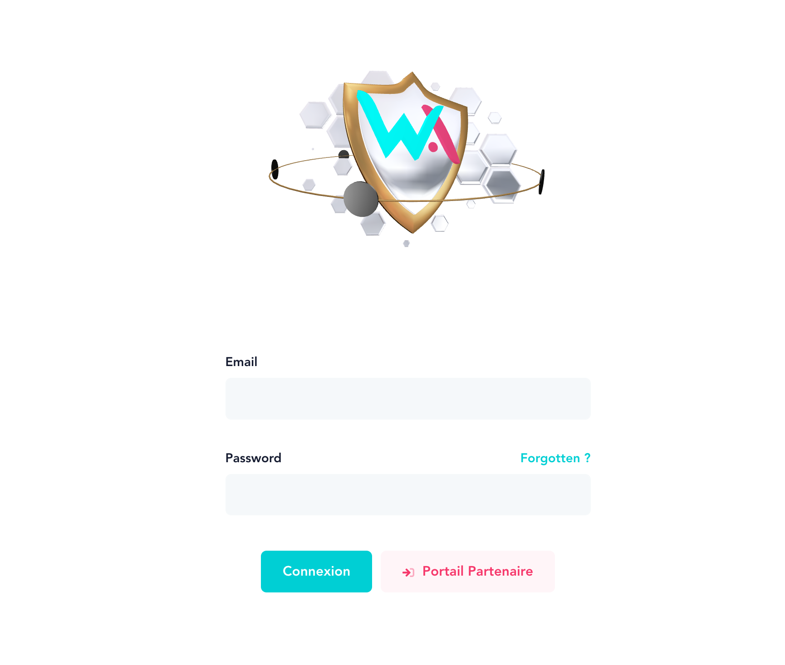
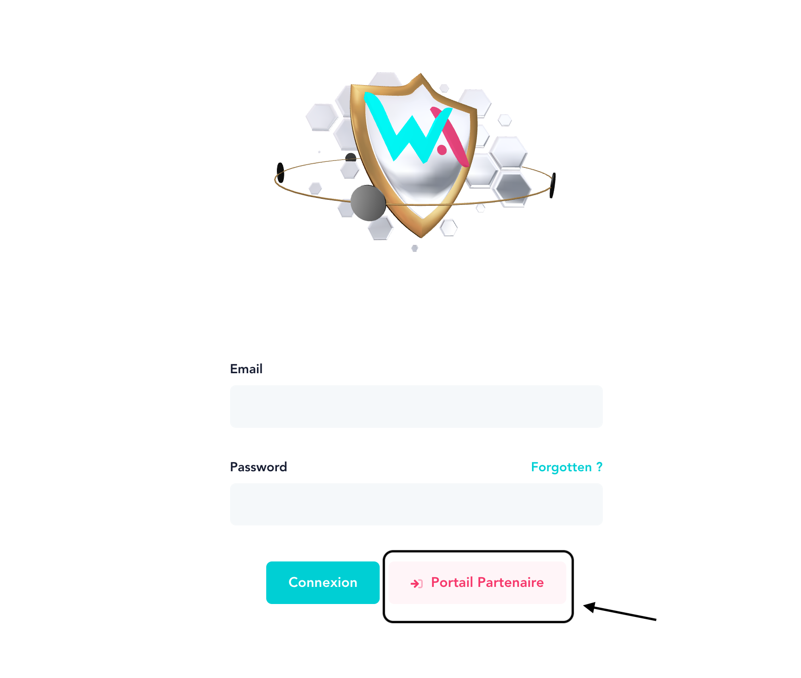
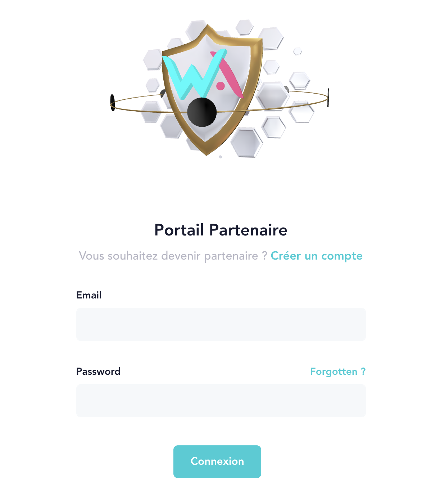
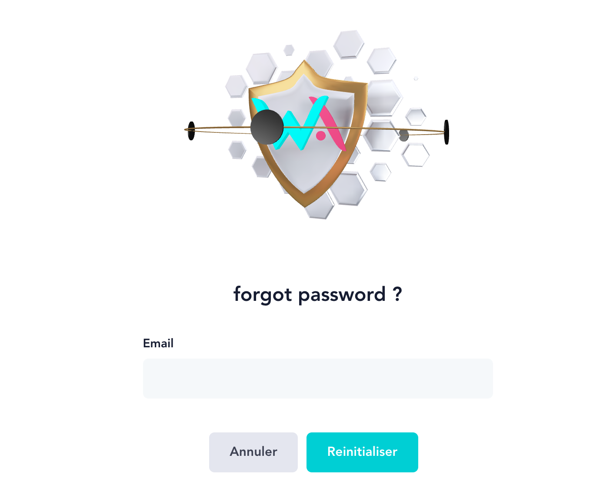

# Authentification

## Code d'accès

Pour avoir accès au tableau de bord du comparateur, le collaborateur doit disposer d’accès composé d’une adresse électronique et d’un mot de passe. 

Pour obtenir les accès chez WiASSUR le collaborateur peut se tourner vers les membres du département informatique ou vers les membres de la ligne hiérarchique. 

Les accès sont attribué sur la V2 par la ligne hiérarchique.

## Connexion
### Connexion Collaborateur

Avec vos accès, vous pouvez vous connectez à l'application.

### Connexion Partenaire

En tant que partenaire, vous pouvez vous connecter en cliquant sur le boutton Portail Partenaire ci-dessus et ainsi vous rendre sur la page de connexion partenaire ci-dessous.

Avec vos accès, vous pouvez vous connectez à l'application.

## Mot de passe oublié
En cas de mot de passe oublié, cliquez sur `Forgotten ?` et vous serez rediriger vers la page mot de passe oublié ci-dessous.

Indiquez votre email d'accès dans le champ prévu à cet effet. Un courriel vous sera envoyé pour vous permettre de réinitialiser votre mot de passe.